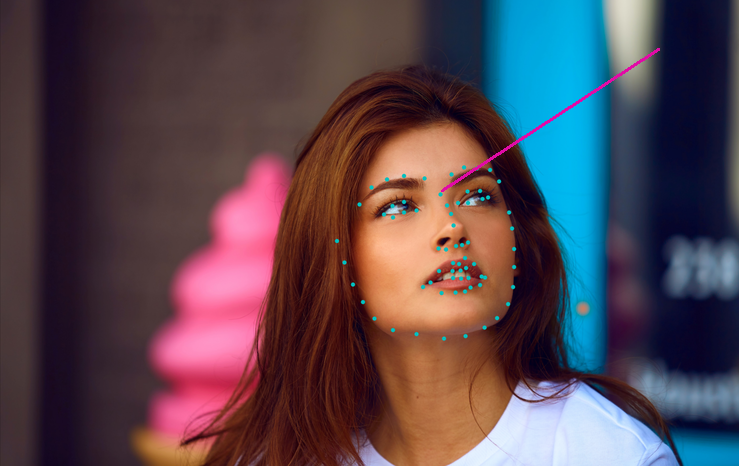

# Human-Pose-Recognition-in-Videogames

## Descrizione
Questo progetto consiste, sulla base di un sistema per il rilevamento facciale già sviluppato da terzi, nella stima della direzione del volto e la sua applicazione in ambientazioni 3D e videogames.
L'obiettivo è stato quello di creare un sistema in grado di acquisire ed elaborare una sequenza di immagini allo scopo di estrarre le informazioni relative al volto rilevato per inviarle ad un server tcp, incaricato di decodificarle per creare una mappatura 3D e infine determinare il suo orientamento.



Il progetto si articola in tre fasi essenziali: 

• Acquisizione delle immagini per il rilevamento del volto

• Estrazione delle informazioni del volto rilevato e mappatura in 3D

• Identificazione dell’orientamento del volto

La prima fase comprende l’acquisizione di una sequenza di immagini da webcam e il rilevamento del volto. L’acquisizione delle immagini è ottenuta grazie a un algoritmo sviluppato in python che sfrutta la libreria OpenCV e Scikit-image. Il sistema impiega una rete neurale in grado di localizzare 68 punti di riferimento del viso (landmarks). I landmarks vengono organizzati in 9 aree specifiche del viso: contorno facciale, sopracciglio sinistro e destro, naso, narici, occhio sinistro e destro, labbra e denti. La seconda fase comprende l’estrazione delle informazioni, la codifica in un formato specifico, il loro invio a un server tcp in Unity e la mappatura 3D. Le informazioni ottenute riguardano le coordinate di ciascun landmark nelle posizioni x, y e z. Tali informazioni vengono manipolate e inviate al server tcp, permettendo la creazione di una mesh 3D del viso. La terza fase comprende la stima della direzione del volto, ottenuta sfruttando 3 landmarks specifici dai quali è possibile calcolare il punto esatto in cui l’utente sta guardando, grazie alla creazione di un raggio luminoso. Infine tale lavoro è stato integrato in diversi ambienti di gioco, mettendone in evidenza il suo scopo finale.

## Ambiente di sviluppo  💻 

Per l'ambiente di sviluppo e relativa gestione delle librerie è stato utilizzato Anaconda Navigator, da cui sono state installate e sfruttate le seguenti librerie Open source:

• OpenCV

• Scikit-image

• Matplotlib

La libreria OpenCV è stata principalmente utilizzata per l’apertura della fotocamera, l’acquisizione delle immagini e la rilevazione del volto. La libreria Skimage è stata utilizzata per l’elaborazione delle immagini acquisite, mentre la libreria Matplotlib è stata sfruttata per la visualizzazione dei grafici 2D e 3D generati dall’immagine e per ottenere le informazioni fondamentali per la mappatura 3D del volto.

## Acquisizione delle immagini 📸


Il primo passo per lo sviluppo di tale sistema è stata l’acquisizione di una sequenza di immagini. Inizialmente si è partito da un’analisi approfondita del codice, sviluppato da Adrian Bulat, ricercatore di intelligenza artificiale presso l’Università di Nottingham, il quale ha realizzato un sistema per l’addestramento della rete FAN applicata a esperimenti di addestramento e allineamento facciale 2D e 3D. Costruita sulla base di un’avanzata architettura per la stima della posa, chiamata **HourGlass** (HG), la rete prende in input l’immagine RGB, ottiene i punti di riferimento 2D e genera le corrispondenti proiezioni 2D e 3D, passandole successivamente a una seconda rete, responsabile del riconoscimento vero e proprio, chiamata **Facial Recognition Network** (FRN). 

```sh
cam = cv2.VideoCapture(0, cv2.CAP_DSHOW)
count = 0
ListImage = []
while True:
  ret, img = cam.read()
  cv2.imshow("ImageCapture", img)
  if not ret:
    break
  k=cv2.waitKey(2)
  if k%256 == 27:
    break
  else:
    print("Image "+str(count)+" saved...")
    path='../test/assets/'+str(count)+'.jpg'
    cv2.imwrite(path, img)
    ListImage.append(path)
    time.sleep(1)
    count +=1
cam.release()
cv2.destroyAllWindows()
```

Come possibile vedere in **detect_landmarks_in_real-time.py** e dal precedente snippet, l’idea si basa su un’acquisizione di più immagini simultaneamente, principalmente per poter garantire una rappresentazione real-time del movimento della mappatura 3D che si andrà a creare. È stato quindi implementato un semplice algoritmo che tramite l’utilizzo della libreria OpenCV, viene aperto il frame relativo alla fotocamera per l’acquisizione delle immagini con un intervallo di tempo per ognuna impostato ad un secondo, principalmente per permettere all’utente di poter uscire in qualsiasi momento dalla procedura. Nel momento in cui si ritiene conclusa la procedura, è stata aggiunta la possibilità di fare in modo che cliccando sul tasto “Esc”, l’utente concluda l’operazione di acquisizione. L’immagine o sequenza di immagini acquisite vengono salvate in un path specifico e i nomi delle immagini sono inserite in un array, incrementando di volta in volta una variabile contatore. Vediamo ora in dettaglio il seguente codice:

```sh
l = 0
while l<len(ListImage):
  try:
    print("Avvio Riconoscimento Volto n."+str(l))
    input_img = io.imread(ListImage[l])
  except FileNotFoundError:
    input_img = io.imread('../test/assets/aflw-test.jpg')
```

La variabile contatore viene utilizzata per scorrere l’array, in modo tale da passare singolarmente ciascun path alla rete FAN, la quale procederà al rilevamento e all’allineamento facciale. Nel caso in cui la rete non rilevi la presenza di un volto, è stata data come eccezione un’immagine di test, mostrando all’utente da terminale un messaggio di mancato riconoscimento facciale.
