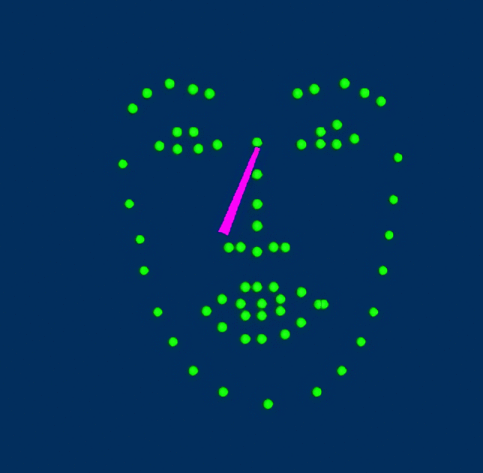

# Human-Pose-Recognition-in-Videogames

## Descrizione
Questo progetto consiste, sulla base di un sistema per il rilevamento facciale già sviluppato da terzi, nella stima della direzione del volto e la sua applicazione in ambientazioni 3D e videogames.
L'obiettivo è stato quello di creare un sistema in grado di acquisire ed elaborare una sequenza di immagini allo scopo di estrarre le informazioni relative al volto rilevato per inviarle ad un server tcp, incaricato di decodificarle per creare una mappatura 3D e infine determinare il suo orientamento.


Il progetto si articola in tre fasi essenziali: 

• Acquisizione delle immagini per il rilevamento del volto

• Estrazione delle informazioni del volto rilevato e mappatura in 3D

• Identificazione dell’orientamento del volto

La prima fase comprende l’acquisizione di una sequenza di immagini da webcam e il rilevamento del volto. L’acquisizione delle immagini è ottenuta grazie a un algoritmo sviluppato in python che sfrutta la libreria OpenCV e Scikit-image. Il sistema impiega una rete neurale in grado di localizzare 68 punti di riferimento del viso (landmarks). I landmarks vengono organizzati in 9 aree specifiche del viso: contorno facciale, sopracciglio sinistro e destro, naso, narici, occhio sinistro e destro, labbra e denti. La seconda fase comprende l’estrazione delle informazioni, la codifica in un formato specifico, il loro invio a un server tcp in Unity e la mappatura 3D. Le informazioni ottenute riguardano le coordinate di ciascun landmark nelle posizioni x, y e z. Tali informazioni vengono manipolate e inviate al server tcp, permettendo la creazione di una mesh 3D del viso. La terza fase comprende la stima della direzione del volto, ottenuta sfruttando 3 landmarks specifici dai quali è possibile calcolare il punto esatto in cui l’utente sta guardando, grazie alla creazione di un raggio luminoso. Infine tale lavoro è stato integrato in diversi ambienti di gioco, mettendone in evidenza il suo scopo finale.

## Ambiente di sviluppo  💻 

Per l'ambiente di sviluppo e relativa gestione delle librerie è stato utilizzato Anaconda Navigator, da cui sono state installate e sfruttate le seguenti librerie Open source:

• OpenCV

• Scikit-image

• Matplotlib

La libreria OpenCV è stata principalmente utilizzata per l’apertura della fotocamera, l’acquisizione delle immagini e la rilevazione del volto. La libreria Skimage è stata utilizzata per l’elaborazione delle immagini acquisite, mentre la libreria Matplotlib è stata sfruttata per la visualizzazione dei grafici 2D e 3D generati dall’immagine e per ottenere le informazioni fondamentali per la mappatura 3D del volto.

## Acquisizione delle immagini 📸


Il primo passo per lo sviluppo di tale sistema è stata l’acquisizione di una sequenza di immagini. Inizialmente si è partito da un’analisi approfondita del codice, sviluppato da Adrian Bulat, ricercatore di intelligenza artificiale presso l’Università di Nottingham, il quale ha realizzato un sistema per l’addestramento della rete FAN applicata a esperimenti di addestramento e allineamento facciale 2D e 3D. Costruita sulla base di un’avanzata architettura per la stima della posa, chiamata **HourGlass** (HG), la rete prende in input l’immagine RGB, ottiene i punti di riferimento 2D e genera le corrispondenti proiezioni 2D e 3D, passandole successivamente a una seconda rete, responsabile del riconoscimento vero e proprio, chiamata **Facial Recognition Network** (FRN). 

```sh
cam = cv2.VideoCapture(0, cv2.CAP_DSHOW)
count = 0
ListImage = []
while True:
  ret, img = cam.read()
  cv2.imshow("ImageCapture", img)
  if not ret:
    break
  k=cv2.waitKey(2)
  if k%256 == 27:
    break
  else:
    print("Image "+str(count)+" saved...")
    path='../test/assets/'+str(count)+'.jpg'
    cv2.imwrite(path, img)
    ListImage.append(path)
    time.sleep(1)
    count +=1
cam.release()
cv2.destroyAllWindows()
```

Come possibile vedere in **detect_landmarks_in_real-time.py** e dal precedente snippet, l’idea si basa su un’acquisizione di più immagini simultaneamente, principalmente per poter garantire una rappresentazione real-time del movimento della mappatura 3D che si andrà a creare. È stato quindi implementato un semplice algoritmo che tramite l’utilizzo della libreria OpenCV, viene aperto il frame relativo alla fotocamera per l’acquisizione delle immagini con un intervallo di tempo per ognuna impostato ad un secondo, principalmente per permettere all’utente di poter uscire in qualsiasi momento dalla procedura. Nel momento in cui si ritiene conclusa la procedura, è stata aggiunta la possibilità di fare in modo che cliccando sul tasto “Esc”, l’utente concluda l’operazione di acquisizione. L’immagine o sequenza di immagini acquisite vengono salvate in un path specifico e i nomi delle immagini sono inserite in un array, incrementando di volta in volta una variabile contatore. 

Vediamo ora in dettaglio il seguente codice:

```sh
l = 0
while l<len(ListImage):
  try:
    print("Avvio Riconoscimento Volto n."+str(l))
    input_img = io.imread(ListImage[l])
  except FileNotFoundError:
    input_img = io.imread('../test/assets/aflw-test.jpg')
```

La variabile contatore viene utilizzata per scorrere l’array, in modo tale da passare singolarmente ciascun path alla rete FAN, la quale procederà al rilevamento e all’allineamento facciale. Nel caso in cui la rete non rilevi la presenza di un volto, è stata data come eccezione un’immagine di test, mostrando all’utente da terminale un messaggio di mancato riconoscimento facciale.

## Rilevamento e Riconoscimento del volto

Una volta acquisite le immagini si è proceduto al rilevamento e riconoscimento del volto, ottenuto sfruttando la rete FAN (Face-Alignment Network), in grado di ricavare le proiezioni 2D e 3D dei punti di riferimento facciali.

### Face-Alignment Network


In tale sistema è stata impiegata la “Face-Alignment Network” (FAN). Sviluppata da Adrian Bulat, FAN è una rete neurale all’avanguardia per la localizzazione dei punti di riferimento del volto, pre-addestrata per l'allineamento di volti in 2D e 3D e valutata su centinaia di migliaia di immagini. Tale rete si è mostrata fin da subito affidabile e con un basso margine di errori, garantendo una considerevole capacità di resistenza a posa, risoluzione e illuminazione. I test eseguiti da Adrian Bulat su set di dati indipendenti, rispettivamente per il 2D, Dal 2D al 3D e il 3D, hanno mostrato ottimi risultati. Lo sviluppo del progetto non ha previsto un addestramento della macchina utilizzata, poiché la rete risulta pre-addestrata e quindi in grado di poter effettuare senza alcun problema il riconoscimento e l’allineamento dei punti facciali. Una volta ricevuta un’immagine RGB in input, viene riconosciuto un numero fissato di punti per ogni area del viso in questione.

```sh
preds = fa.get_landmarks(input_img)[-1]
# 2D-Plot
plot_style = dict(marker='o',
markersize=4,
linestyle='-',
lw=2)
pred_type = collections.namedtuple('prediction_type', ['slice', 'color'])
pred_types = {'face': pred_type(slice(0, 17), (0.682, 0.780, 0.909, 0.5)),
'eyebrow1': pred_type(slice(17, 22), (1.0, 0.498, 0.055, 0.4)),
'eyebrow2': pred_type(slice(22, 27), (1.0, 0.498, 0.055, 0.4)),
'nose': pred_type(slice(27, 31), (0.345, 0.239, 0.443, 0.4)),
'nostril': pred_type(slice(31, 36), (0.345, 0.239, 0.443, 0.4)),
'eye1': pred_type(slice(36, 42), (0.596, 0.875, 0.541, 0.3)),
'eye2': pred_type(slice(42, 48), (0.596, 0.875, 0.541, 0.3)),
'lips': pred_type(slice(48, 60), (0.596, 0.875, 0.541, 0.3)),
'teeth': pred_type(slice(60, 68), (0.596, 0.875, 0.541, 0.4))
}
```

Le informazioni ottenute da FAN sono contenute all’interno della variabile preds. La variabile **preds** è un array bidimensionale, caratterizzato dai punti di riferimento facciali individuati dalla rete, in particolare al suo interno sono contenute le coordinate di ogni punto riconosciuto. Dal codice 2.4 possiamo vedere che i punti riconosciuti sono organizzati secondo una struttura ben definita, rappresentata da pred_type. Pred_type è una struttura che permette di organizzare i punti facciali suddividendoli in 9 aree specifiche del volto, tra cui: faccia (il contorno del viso), sopracciglio sinistro, sopracciglio destro, naso, narici, occhio sinistro, occhio destro, labbra e denti. Ottenuti i punti di riferimento 2D, il compito di FAN è quello di convertirli in 3D, ovvero creare delle proiezioni a partire dai punti di riferimento facciali 2D. Per realizzare tale obiettivo è stata introdotta un’estensione della rete FAN dal 2D al 3D in grado di poter stimare la coordinata z (ovvero la profondità di ciascun punto). Una volta ottenute anche tali informazioni, il sistema procede con la realizzazione di grafici 2D e 3D applicati all’immagine in input. Di seguito vengono mostrati alcuni esempi di grafici 2D ottenuti dal riconoscimento.

### Rappresentazione del volto riconosciuto

Una volta effettuate le operazioni iniziali di acquisizione e riconoscimento, il sistema prevede la visualizzazione a schermo del risultato ottenuto, caratterizzato da una finestra contenente l’immagine 2D presa in input, il grafico 2D presente sul volto riconosciuto e il grafico 3D.

## Manipolazione dei landmarks

Il processo di rilevamento e riconoscimento del volto avviene quindi in due passi principali: per prima cosa, data l’immagine acquisita, ne vengono riconosciuti i landmarks tramite l’utilizzo della rete FAN. Successivamente tali landmarks vengono utilizzati per la realizzazione dei grafici 2D e 3D. Per la creazione di una mappatura 3D del volto è necessario gestire le coordinate dei landmarks, cioè convertirle in uno specifico formato per poi essere inviate al server tcp, che riceverà tali coordinate, le quali verranno decodificate e utilizzate per istanziare i vari landmarks in Unity, ottenendo così una mesh 3D del volto riconosciuto.

## Estrazione delle coordinate

La variabile preds è un’array bidimensionale in cui sono contenute le coordinate tridimensionali (x, y, z) di ciascun landmark, per un totale di 68 landmarks. Tale risultato è ottenuto utilizzando la funzione **get_landmarks(self, image_or_path, detected_faces=None)** contenuta nel file **api.py**, dove al suo interno sono presenti tutte le funzioni necessarie per la rilevazione e il riconoscimento dei landmarks. Tale funzione ha come risultato il valore ottenuto dalla funzione get_landmarks_from_image(image_or_path, detected_faces=None):

```sh
def get_landmarks(self, image_or_path, detected_faces=None): 
  """Deprecated, please use get_landmarks_from_image 
  Arguments: 
    image_or_path {string or numpy.array or torch.tensor} -- The input image or path to it. 
  Keyword Arguments: 
    detected_faces {list of numpy.array} -- list of bounding boxes, one for each face found in the image (default: {None}) """ 
    
    return self.get_landmarks_from_image(image_or_path, detected_faces=None)
```

## Comunicazione server tcp

Per poter mappare il volto in Unity è necessario l’utilizzo di un server tcp per la ricezione delle coordinate dei landmarks inviate lato pyton. In Unity il server è stato sviluppato integrando **slessans**, che consente ai client di connettersi al server e inviare token, cioè stringhe contenenti le coordinate di ciascun landmark seguite da un separatore “&”. Per la creazione del server è stato utilizzato un gameObject persistente (sfera) a cui è stato allegato lo script **SCL_PositionalControllerInput.cs**, che permette di collegarsi ad un client, leggere i 3 valori di posizione (x, y, z) per poi convertirli da formato stringa a float.
L’invio delle coordinate al server tcp in Unity è stato gestito in python mediante l’utilizzo della libreria socket. Una volta completato l’applicativo server lato Unity, si è proceduto con la creazione del client.

```sh
with socket.socket(socket.AF_INET, socket.SOCK_STREAM) as s: 
  s.connect(('127.0.0.1', 13000)) 
  i = 0 
  while i < len(preds): 
    string = str(preds[i])+'&'
    msg = bytes((string), 'utf-8')
    s.sendall(msg) 
    time.sleep(0.2) 
    i = i + 1
```

Dal codice precedente, socket.socket è stato utilizzato per creare un oggetto socket, mentre gli argomenti passati specificano la famiglia di indirizzi, ovvero IPv4, e il tipo di socket. Il client chiama connect(“127.0.0.1”,13000) per stabilire una connessione al server attraverso un host e una porta unica. In questo caso solo il client può raggiungere il server, e non viceversa. Una volta collegato il client al server, si è gestito l’array preds attraverso l’uso di una variabile contatore e un ciclo che prendendo in input la lunghezza dell’array, viene scorso convertendo le coordinate di ciascun landmark in formato stringa e tramite s.sandall() inviato come oggetto byte al server . Tale operazione si ripete per ogni landmark riconosciuto, con un intervallo di invio impostato a 0.2 secondi. Di seguito è riportato il risultato ottenuto su console Unity:


### Decodifica delle coordinate dei landmark

Per ogni token ricevuto è opportuno stabilirne un formato specifico, in modo che tali coordinate possano essere utilizzate per istanziare ciascun landmark riconosciuto in Unity. É possibile vedere che le coordinate che vengono inviate al server presentano un formato caratterizzato dalla presenza di caratteri che non ne permettono l’utilizzo. Per rimuovere questi caratteri fondamentale è stato l’utilizzo del modulo re. Il modulo re fornisce operazioni per la corrispondenza delle espressioni regolari. Tali espressioni regolari usano il carattere (‘\’) per indicare forme speciali o per consentire l'uso di caratteri speciali senza invocarne il significato, inoltre le funzioni in questo modulo consentono di verificare se una determinata stringa corrisponde a una certa espressione regolare. La soluzione proposta prevede l’utilizzo di re.sub(), che a seconda del pattern dato in input permette di sostituire i caratteri non richiesti, in questo caso le parentesi quadre. 

Successivamente è stata implementata la funzione man_string(string), in grado di assegnare a ciascuna stringa un formato valido. La funzione man_string() riceve come parametro la stringa ottenuta da re.sub(), la quale è concatenata con il carattere “&” affinché il server riconosca il token correttamente. Per evitare la presenza di eventuali errori di formato si è poi aggiunto un ulteriore controllo, cioè “string.strip()” per verificare se il token presenta spazi iniziali e finali, in tal caso verranno rimossi. Di seguito viene riportato il risultato finale utilizzando la funzione man_string(string):


### Rappresentazione Volto in Unity

Una volta estrapolate le coordinate dai landmarks riconosciuti, lo sviluppo del sistema si è poi concentrato sulla loro rappresentazione grafica in Unity, ottenendo lo stesso grafico generato nella GUI di matplotlib. Si e proceduto utilizzando le coordinate di formato x,y,z di ciascun landmark per istanziare un gameObject di tipo sfera. La sfera, chiamata “marker”, è un gameObject di tipo prefab. Per poter istanziare correttamente ogni landmark è stato utilizzato lo script CreaOggetti.cs. Innanzitutto sono state istanziate la variabile **controllerInput**, che permette di comunicare con SCL_PositionalControllerInput per prendere in input le coordinate ricevute e decodificate, e **proiettile** per istanziare il gameObject sfera. Affinchè ogni prefab possa essere istanziato è stato utilizzato il metodo Update(), in quanto essendo richiamato ad ogni frame risulta il più adatto per ricevere in real-time le coordinate. Tale tecnica permette la realizzazione di una singola mappatura 3D del volto riconosciuto.


### Orientamento del volto

Per riconoscere l’orientamento del volto è stato utilizzato lo script rettaPerpendicolare.cs, il quale è stato aggiunto ad un gameObject con mesh filter, necessario per la generazione di un raggio luminoso indicante la direzione. L’orientamento del volto è calcolato prendendo in considerazione le coordinate di tre landmarks specifici del volto: Landmark occhio sinistro, Landmark occhio destro, Landmark labbro superiore.
Una volta salvato il vettore di posizione di ciascun landmark, lo script rettaPerpendicolare.cs richiama tali vettori per istanziare tre gameObject sfera, necessari per la generazione del raggio. Così come in CreaOggetti.cs, anche in questo script la procedura viene svolta in Update(), in cui viene effettuato un controllo per verificare se tutti i prefab del volto sono stati istanziati correttamente. A questo punto, per poter generare il raggio è stata richiamata la variabile mesh, a cui sono stati passati come vertici i vettori di posizione precedenti e utilizzato il metodo RecalculateNormals() per ricalcolare le normali della mesh da triangoli e vertici. Da questo si è proceduto istanziando la componente Linerender lr, la quale permette di generare una linea retta nello spazio 3D circostante ed è stato aggiunto un materiale affinché sia visibile dalla rappresentazione finale.

La posizione iniziale della linea è stata calcolata individuando il punto medio tra i due occhi, mentre la posizione finale è ottenuta sommando alle normali della mesh il vettore di posizione del gameObject in cui lo script è stato aggiunto. Il risultato finale è mostrato come segue:



### Integrazione in Ambientazioni 3D e Videogames

Determinato l'orientamento del volto, si è deciso di integrare il sistema in alcuni progetti di tesi sviluppati dai alcuni miei colleghi. Trattandosi di giochi e ambientazioni 3D basate sul riconoscimento dell’emozione dell’utente, l’idea è stata quella di poter integrare questo progetto per coinvolgere maggiormente l’utente nella sessione di gioco e nell’ambientazione circostante. Per mettere in pratica tale idea si è proceduto analizzando i modi e le dinamiche con cui l’utente possa interagire maggiormente con ogni applicativo sviluppato, rendendolo divertente e avvincente. Mentre l’utente sta giocando oppure se si trova in una particolare ambientazione, viene rilevato il suo volto, identificato l’orientamento e da esso generati oggetti che vanno a ostacolare/sorprendere l’utente. Lo spawn degli oggetti è stato realizzato in modo che quando l’utente guarda in una direzione, l’oggetto viene generato dalla direzione opposta. Analizzando la direzione del volto e in particolare il raggio generato, si è pensato di dividere l’area visiva dell’utente in tre sezioni: sinistra, centro e destra.
In un videogame incentrato sull’Air Hockey, gli oggetti che vengono creati sono pietre, le quali diventano parte attiva del game. Le pietre nel caso in cui l’utente guarda a sinistra o destra vengono fatte cadere sul tavolo da gioco impedendo il passaggio del dischetto e disturbando l’utente nel gioco. 

Di seguito viene mostrato il risulto finale:


In un altro progetto la tecnica utilizzata è stata la medesima, ma essendo un applicativo con diverse ambientazioni 3D, la generazione degli oggetti è risultata singolare per ognuno. Nell’ambientazione spazio, per cercare di rendere l’utente sorpreso è stato fatto in modo che gli oggetti creati fossero caratteristici, generando un’astronave con effetti luminosi nel caso in cui l’utente guarda a sinistra, e un robottino nel caso in cui l’utente guarda a destra.


Nell’ambientazione Natura l’utente si trova in un ambiente tranquillo, caratterizzato da un paesaggio con alberi e colline. Per far sì che l’utente possa interagire maggiormente, gli oggetti che vengono creati in base all’orientamento del volto sono animali, in particolare viene generato un coniglio se l’utente guarda alla sua sinistra e un maialino se l’utente guarda alla sua destra.


Tale sistema, integrandolo in altri progetti in cui si richiedeva un maggior coinvolgimento degli utenti nell'ambientazione, ha quindi evidenziando una certa flessibilità di utilizzo e validità.

### Ambiente di Sviluppo
